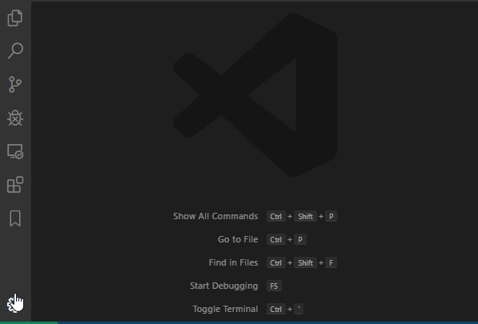

# DAI Theme

This extension extends the 'Visual Studio Dark' file theme for more DAI specific color tokens.

> Note: You need to set the file theme in VS Code to 'Dark (Visual Studio) - DAI'
> for this extension to work.

   
  
   

**Enjoy!**
